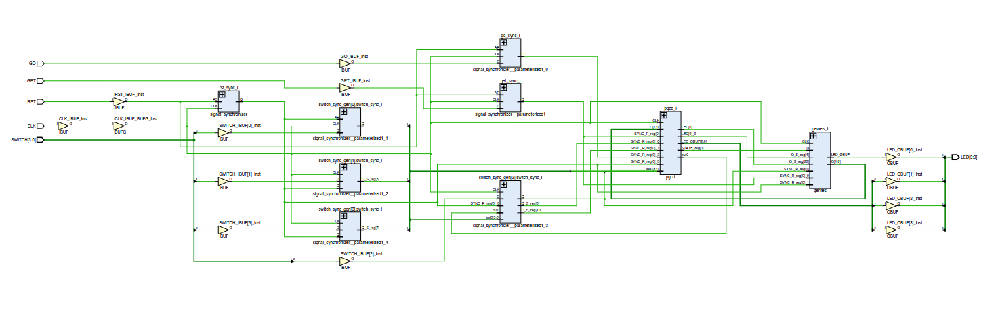

# GCD FPGA Implementation on Zybo Z7

This project implements the calculation of the **Greatest Common Divisor (GCD)** on a **Xilinx Zybo Z7 FPGA** using **VHDL**. The design takes two input values via switches, calculates the GCD, and displays the result on the LEDs.

## How it works

1. **Input**: The user provides two integers using the switches on the Zybo Z7 board.
2. **Processing**: The FPGA calculates the **GCD** of the two input numbers using an algorithm implemented in VHDL.
3. **Output**: The result is displayed on the LEDs.

### System Structure

The design consists of multiple functional blocks, each responsible for a specific task. Below is the schematic representation of the FPGA implementation, showing how each block interacts with others.

### Before Calculation

### After Calculation

## Folder Structure

- `img/`: Contains images showing the Zybo Z7 before and after the calculation, and the system structure diagram.
- `src/`: Contains the VHDL source code files for the GCD calculation logic.
- `README.md`: This file, providing project details.

## Requirements

- Xilinx Zybo Z7 FPGA
- Vivado for VHDL synthesis and implementation

## License

This project is open-source. Feel free to contribute or modify it as per your needs.
